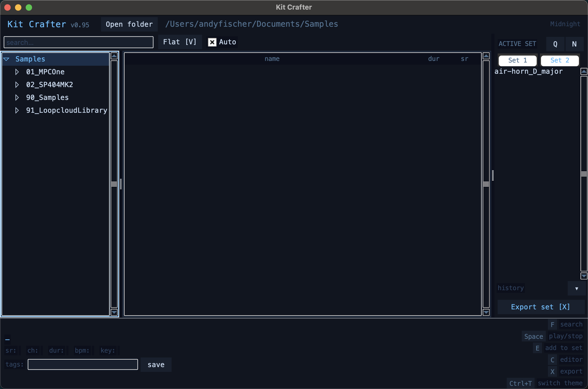
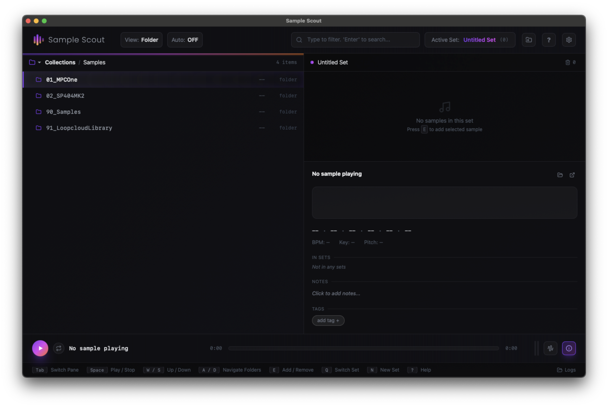

# Kit Crafter

A keyboard-first desktop app for browsing, previewing, trimming, and exporting audio samples — built for drum machine and sampler workflows.




---
## Editor's note: Sample Scout, app-cloning, prompt-versioning

This software is HEAVILY inspired by an app called Sample Scout. You can find it here: https://samplescout.app/ . Actually it is so heavily inspired that it might be seen cringe-worthy. Sample Scout is the original one. It's an awesome app with an awesome idea behind it, awesomely built. You should have a look at it. You should buy it. It is the better app.



My version of the app is less detailed, less precise, less error-resistant. It's a thing I did while being bored on holiday.

When I looked at one video reviewing Sample Scout I came across a comment that mentioned the vibe-coded-ness of the colour scheme. Which- and this is the interesting aspect- immediately made me feel the original developer's effort less worthy. As someone who developed a lot of software and hardware myself, I do know about the effort, the struggle, etc. Even in times of AI, vibecoding etc. I still respect other people's work. I am writing this more out of surprise about how the presence of AI shifts the view on things that, maybe up until last year, have been a result of experience, practice and long coding sessions- even for those in the know.

Furthermore, this is an experiment on how to clone an app. Literally. I want to get familiar with various AI techniques and cloning an app might be an interesting thng to learn from. May include fuzzy testing, code analysis, etc. I strongly think, that app-cloning already IS a topic that developers have to face- for now it'll be smaller apps, but with the increasing power of AI models it will, that's what I think, only be a matter of time for apps to be nothing more than a good idea, than something to earn money with. 

I also think that the structure of open source and/ or git repositories will shift. When it's versioned sourcecode for now, I bet it will be versioned recreation-prompts in the future. The repo contains https://github.com/andymann/kit-crafter/blob/main/RECREATE_PROMPT.md which is extactly that. Let's see if I am correct with my assumption.

---

## Features

- **File browser** — navigate your sample library as a folder tree or flat list, with instant search
- **Autoplay** — samples preview automatically as you move through the list
- **Waveform editor** — set clip in/out points and fade in/out with configurable curves
- **Sets** — curate multiple named sample sets; add files with a single keypress
- **Export pipeline** — batch-export sets with options for format, bit depth, sample rate, mono/stereo, normalization, and high-pass filtering
- **Built-in device presets** — TR-8S, Octatrack, SP-404 MK2, DAW (24-bit)
- **Themeable UI** — cycle through colour themes with `Ctrl+T`
- **State persistence** — last folder, sets, clip edits, and theme are restored on relaunch

---

## Requirements

- Python 3.10+
- [pygame](https://www.pygame.org/) >= 2.5
- [soundfile](https://python-soundfile.readthedocs.io/) >= 0.12
- [numpy](https://numpy.org/) >= 1.24
- [pydub](https://github.com/jiaaro/pydub) >= 0.25

Optional (for high-quality resampling):
- [librosa](https://librosa.org/)

---

## Installation

```bash
git clone https://github.com/yourusername/kit-crafter.git
cd kit-crafter
pip install -r requirements.txt
python main.py
```

To open a library folder on launch:

```bash
python main.py /path/to/samples
```

---

## Keyboard Shortcuts

### Navigation
| Key | Action |
|-----|--------|
| `↑` / `↓` | Move through folders and files |
| `→` | Expand folder (press again to enter it) |
| `←` | Go up to parent folder |
| `Enter` | Jump to file list |
| `F` | Focus search field |
| `V` | Toggle flat / folder view |
| `Esc` | Cancel search / go back |

### Playback
| Key | Action |
|-----|--------|
| `Space` | Play / stop current file |
| `Tab` | Toggle autoplay |

### Set Management
| Key | Action |
|-----|--------|
| `E` | Add selected file to active set |
| `Shift+E` | Quick-add to a different set |
| `N` | New set |
| `Q` | Cycle to next set |
| `Delete` | Remove selected set item |

### Panels
| Key | Action |
|-----|--------|
| `C` | Open waveform editor |
| `X` | Open export panel |
| `Ctrl+T` | Cycle colour theme |
| `?` | Show shortcuts overlay |
| `Esc` | Close panel / go back |

---

## Export Settings

The export pipeline processes each file in this order:

1. Clip region applied
2. Fades applied
3. Mono mix-down (if enabled)
4. Resampling (uses librosa if available, falls back to linear interpolation)
5. High-pass filter (optional, first-order IIR)
6. Normalization (optional, configurable dBFS ceiling)
7. Write to WAV / AIFF / FLAC at 16-, 24-, or 32-bit depth

All export work runs in a background thread so the UI stays responsive.

---

## Project Structure

```
kit-crafter/
├── main.py              # Entry point
├── constants.py         # App name and version
├── requirements.txt
├── core/
│   ├── audio_engine.py  # Playback via pygame
│   ├── clip_model.py    # Clip/fade metadata (no audio touched until export)
│   ├── exporter.py      # Export pipeline and batch exporter
│   ├── file_scanner.py  # Directory tree scanning
│   └── set_manager.py   # Named sample sets
└── ui/
    ├── app_window.py    # Main window, layout, global key bindings
    ├── browser_panel.py # File tree and search
    ├── editor_view.py   # Waveform clip editor
    ├── set_panel.py     # Set list and management
    ├── detail_pane.py   # File metadata display
    ├── export_panel.py  # Export UI
    ├── waveform_view.py # Waveform rendering
    ├── shortcuts_overlay.py
    └── theme.py         # Colour themes
```

---

## License

MIT
